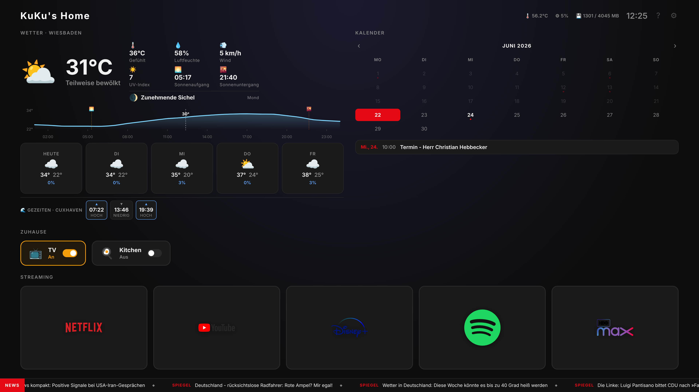

# KuKu's Home

A TV kiosk dashboard for a Raspberry Pi 5 connected to a 4K display. Built with HTML, TypeScript, and Vite — no framework.



## Features

- **Weather** — current conditions, 5-day forecast, moon phase, sunrise/sunset; hourly temperature graph (±12 h) with rain probability bars and sunrise/sunset markers (Open-Meteo)
- **Tides** — today's high/low tide extremes with station name (Stormglass API)
- **Calendar** — monthly grid + upcoming events with month navigation (Google Calendar ICS)
- **Home Assistant** — toggle switches and lamps directly from the dashboard
- **Streaming shortcuts** — one-click links to Netflix, YouTube, Disney+, Spotify, HBO Max
- **System stats** — CPU temperature, CPU usage, RAM usage
- **Multilingual** — English, German, Spanish
- **Configurable** — dashboard title, location, language, calendar URL via settings modal

## Stack

- **Frontend:** HTML + TypeScript + CSS (Vite, no framework)
- **Backend:** Python HTTP server (`server/stats.py`) on port 3001
- **Serving:** nginx on port 80
- **Display:** Chromium in kiosk mode, `--force-device-scale-factor=2` for 4K

## Setup

### Prerequisites

- Node.js 20+
- Python 3.x with `websocket-client` (`pip install websocket-client`)
- nginx
- A Raspberry Pi (or any Linux machine)

### Install

```bash
git clone https://github.com/elkuku/pitv-dashboard.git
cd pitv-dashboard
npm install
```

### Configuration

Copy and edit the HA config (gitignored):

```bash
cp server/ha-config.example.json server/ha-config.json
```

```json
{
  "url": "http://<home-assistant-ip>:8123",
  "token": "<long-lived access token>",
  "stormglass_key": "<optional — from stormglass.io>",
  "tide_lat": 53.8655,
  "tide_lng": 8.6941,
  "devices": [
    { "entity_id": "switch.my_switch", "name": "TV", "icon": "📺" }
  ]
}
```

Calendar ICS URL and location are set via the in-app settings modal (press `S` or the gear icon). They are stored in browser `localStorage`.

### Build & deploy

```bash
npm run build
cp -r dist/. /var/www/pitv/
```

### Run the stats server

```bash
systemctl --user start pitv-stats
```

Or directly:

```bash
python3 server/stats.py
```

## Development

```bash
npm run dev      # Vite dev server
npm run check    # TypeScript type check
```

## API endpoints

All served via nginx proxy from `/api/`:

| Endpoint | Description |
|----------|-------------|
| `GET /api/stats` | CPU temp, CPU%, RAM |
| `GET /api/calendar?url=` | ICS proxy (avoids CORS) |
| `GET /api/ha/devices` | HA device list with live state |
| `POST /api/ha/toggle` | Toggle a switch `{ entity_id }` |
| `GET /api/tides?lat=&lng=` | Tide extremes for today (Stormglass, cached per day) |

## External services

| Service | Purpose | Key required |
|---------|---------|--------------|
| [Open-Meteo](https://open-meteo.com) | Weather + geocoding | No |
| [Stormglass](https://stormglass.io) | Tide data (10 req/day free) | Yes |
| Home Assistant | Device control | Long-lived token |
| Google Calendar | ICS feed | No (public ICS URL) |
